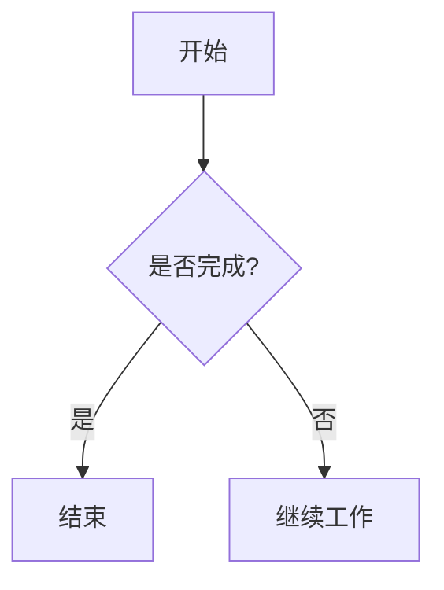

# Hexo 标签语法参考（完整版）

本文档列出Hexo博客（Butterfly/NexT主题）中常用的标签语法和Markdown排版元素，包含高级技巧。

## 1. Note 块（Butterfly主题）

### 基本语法

```njk

内容（支持Markdown）

```

### type 类型

| 类型 | 图标 | 颜色风格 | 适用场景 |
|------|------|----------|----------|
| `primary` | 星标 | 紫色/蓝色 | 章节总标题、重要引言、下载链接 |
| `info` | 信息(i) | 蓝色 | 子章节、详细说明、补充信息、人物介绍 |
| `success` | 勾选 | 绿色 | 背景设定、世界构建、正面结论 |
| `warning` | 警告(!) | 黄色/橙色 | 理论说明、注意事项、重要提醒 |
| `danger` | 危险(×) | 红色 | 时代分隔、关键转折、警示内容 |

### flat 修饰符

添加 `flat` 可使note块样式更扁平简洁：

```njk

## 简洁风格的标题
内容...

```

### 标签（label）

可在类型后添加自定义标签：

```njk

#### [云末王冕](https://example.com)
**导言**：...
**概述**：...
**定位**：...
**结构**：...

```

### 嵌套使用

Note块内可以包含Markdown格式内容，包括标题、列表、链接等：

```njk

### 子章节标题
- 要点一
- 要点二

```

## 2. Label 标签

用于高亮显示文字片段：

```njk






```

## 3. Button 按钮

```njk


```

## 4. 链接

```njk

```

## 5. More 截断

在文章摘要截断处插入：

```markdown
<!--more-->
```

## 6. Markdown 基础排版元素

### 标题

```markdown
# 一级标题（正文中禁止使用，仅保留给frontmatter的title）
## 二级标题（主要章节）→ 包裹在  中
### 三级标题（小节）→ 包裹在  中
#### 四级标题（条目，最多到此层级）
```

**规则**：不跳级，不超过4级，标题长度尽量在20字以内。

### 粗体和斜体

```markdown
**粗体重点文字**
*斜体文字*（中文排版中不使用斜体）
```

### 引用

```markdown
> 一级引用
> > 二级引用
```

### 列表

```markdown
- 无序列表项
- 无序列表项

1. 有序列表项
2. 有序列表项
```

嵌套列表需缩进2个空格（不使用Tab）：
```markdown
- 外层列表项
  - 内层列表项
    - 更深层列表项
```

### 任务列表

```markdown
- [ ] 待办事项
- [x] 已完成事项
```

### 表格

```markdown
| 列1 | 列2 | 列3 |
|-----|-----|-----|
| 内容 | 内容 | 内容 |
```

表格对齐：
```markdown
| 左对齐 | 居中对齐 | 右对齐 |
|:-------|:--------:|-------:|
| 内容 | 内容 | 内容 |
```

### 分割线

```markdown
------
```

### 代码

````markdown
`行内代码`

```javascript
// 代码块（始终指定语言标识）
console.log("Hello World");
```
````

### 图片

```markdown

```

**精确控制图片（推荐使用HTML）**：
```html

```

### 视频

```html
<video src="视频URL" controls="controls" style="max-width: 100%;"></video>
```

## 7. 文本样式（HTML）

### 字体颜色

```html
<font color=red>红色文字</font>
<font color=blue>蓝色文字</font>
```

### 彩色标签

```html
<span style="color:#fff;background:#f66;padding:2px 8px;border-radius:4px">紧急</span>
<span style="color:#fff;background:#4ade80;padding:2px 8px;border-radius:4px">已完成</span>
```

### Backtick代码风格

```markdown
`行内代码样式文字`
```

## 8. 高级技巧

### 折叠块

用于收纳过长的内容：

```html
<details>
<summary>点击展开查看详情</summary>

这里是被折叠的详细内容，支持完整Markdown语法。

- 列表项1
- 列表项2

</details>
```

### 脚注

```markdown
这是一段文字[^note]。

[^note]: 这是脚注内容，会出现在页面底部。
```

### 进度条（纯文本版）

```markdown
**学习进度** [███████████░░░░░] 75%
**任务完成** [████████████████████] 100%
```

### Mermaid 流程图

````markdown

````

### LaTeX 数学公式（需主题支持）

```markdown
行内公式：$E = mc^2$

块级公式：
$$
\sum_{i=1}^n i = \frac{n(n+1)}{2}
$$
```

### 表格内使用表情与标签

```markdown
| 任务 | 状态 | 优先级 | 备注 |
|------|:----:|:------:|------|
| 用户登录 | ✅ | 高 | 已完成 |
| 数据导出 | 🚧 | 中 | 开发中 |
```

## 9. 示例：一个完整的章节结构

```njk

## INIT:历史与文化之源


正文第一段...

<!--more-->

正文续...


### 1.小节标题


1-1. 条目一的内容...
1-2. 条目二的内容...


#### 子条目


详细内容...


### 重要分隔/时代标记
`关键信息一`
`关键信息二`

```

## 10. 中文排版空格速查

| 场景 | 规则 | 示例 |
|------|------|------|
| 中文 + 英文 | 加空格 | `使用 GitHub 托管` |
| 中文 + 数字 | 加空格 | `耗时 30 分钟` |
| 数字 + 单位 | 加空格 | `16 GB 内存` |
| 数字 + °/% | 不加空格 | `35°` `80%` |
| 全角标点 + 其他字符 | 不加空格 | `测试后，结果如下。` |
| 完整英文句子 | 英文标点规则 | `Stay hungry, stay foolish.` |
